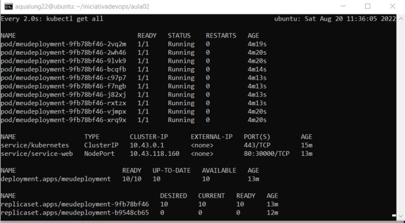

# Orquestração de containers Docker em um cluster Kubernetes local de Alta Disponibilidade com K3d

### Benefícios:
* Resiliência da aplicação
* Atualização sem downtime
* Escalabilidade
* Balanceamento de carga
* Service discovery
* Self-healing

